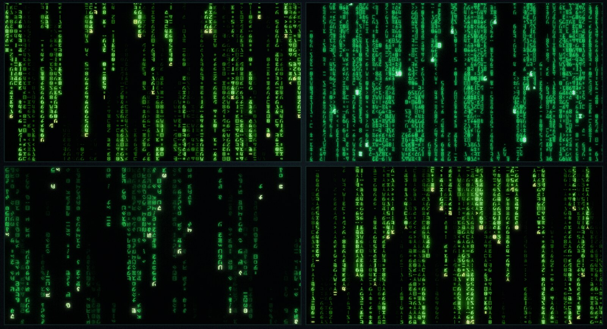
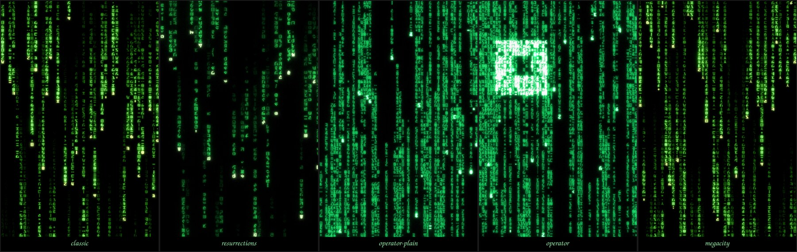

# matrix-rain

**A movie prop for your desktop.** The digital rain from *The Matrix*, running
natively on Linux — on the screen, and inside the terminal you are already
typing in.

```bash
matrix      # the rain on the GPU, with bloom and the intro
redpill     # the same rain, in this terminal, with the film's own glyphs
```



## What it is

A prop, not a screensaver. The difference is the standard it is held to: it has
to survive being looked at closely, on a real screen, next to the film.

So none of it is eyeballed. Every number — fall speed, glyph cycling rate, drop
length, the colour ramp, the bloom — comes from
[Rezmason/matrix](https://github.com/Rezmason/matrix), the reconstruction that
worked the details out from the films themselves, down to the glyph shapes and
the fact that the code is **mirrored**. Measured against it, the colour balance
of this port lands within 0.7%.

This project renders that natively: a Qt Quick shader on the GPU, and a terminal
renderer that falls by the same equation. No browser in the picture, one command
to run it, and it lets go of the terminal the moment it is up — so you can close
that window, and open as many of them as you like.

Five versions, each with its own atlas and parameters:



| | |
|---|---|
| `classic` | The code everyone knows, from the sequels' opening titles. |
| `resurrections` | The updated code from *Matrix Resurrections*. |
| `operator-plain` | The first film's titles and the operators' screens: flatter, crowded, no gradient. |
| `operator` | The same, with the square ripples sweeping across it. |
| `megacity` | The classic code with the Megacity as a glyph, from *Revolutions*. |

## Credits, and what this is not

The rain algorithm, the MSDF glyph atlases and the palettes are
[Rezmason/matrix](https://github.com/Rezmason/matrix), MIT — years of research
that this project only re-renders. If you find this beautiful, the beauty is
upstream's. See [`LICENSE.rezmason`](LICENSE.rezmason).

The finding that Qt's `FrameAnimation` is required — with a `Timer` the clock
advances but the `ShaderEffect` never repaints — comes from tymurbogach's
[enterthematrix](https://github.com/tymurbogach/omarchy-enterthematrix-theme)
theme, which hit the same wall first.

> This is an **unpaid fan project**, released free under MIT. It sells nothing
> and claims no rights over anything it references. It is not affiliated with or
> endorsed by Warner Bros. or anyone else who owns a piece of *The Matrix*. If a
> rights holder would rather it did not exist, say so and it comes down.

## Install

```bash
git clone https://github.com/<you>/matrix-rain
cd matrix-rain
./install.sh
```

You need **Qt 6 Declarative** (for `qml6`) and a GPU that does OpenGL. On Arch
that is `sudo pacman -S qt6-declarative`; every distro ships it under some name.
The terminal version needs nothing but Python 3 from the standard library.

No distro, desktop or window manager is assumed: it is a plain Qt Quick
application plus a Python script.

Everything lands under your home, no `sudo`, in the XDG layout:

| | |
|---|---|
| `~/.local/share/matrix-rain` | the app |
| `~/.local/bin/matrix`, `~/.local/bin/redpill` | the commands |
| `~/.local/share/fonts/` | the film's font, and a derived one for terminals |

`./install.sh --link` symlinks the source tree instead of copying, so edits are
live. `./uninstall.sh` undoes either, and never follows the link when removing.

## On the desktop

```bash
matrix                 # classic, arriving from a blank screen
matrix operator        # start on a specific version
matrix list            # what is available
```

It opens a normal window on your desktop, where you are. That is the whole
design: a prop is something you place, so your window manager decides what
happens to it. Fullscreen it, tile it, float it, put one on each monitor, run
five at once on different versions — nothing here takes the screen from you.

**It detaches from the terminal**, which is what makes that practical. The
prompt comes straight back, the terminal can be closed or reused without taking
the rain with it, and the next `matrix` is another independent window. It is
also in your application launcher as *Matrix Rain*, which starts it with no
terminal in the picture at all. `MATRIX_FOREGROUND=1` keeps it attached, which
is what a script would want.

The intro plays **once, on launch**. While it runs: `v` next version, `i` replay
the intro, `f` fps, `h` hint, `q` quit. Switching shows the version's name for a
couple of seconds and lets it fade.

## In the terminal

```bash
redpill                # the film's own glyphs, right here
redpill operator       # the operator rhythm and density
redpill plain          # one cell per glyph, any font, never a window
```

`MATRIX_FPS`, `MATRIX_PALETTE=classic` and `MATRIX_FONT_SIZE` tune it. There are
no flags: which glyphs your terminal can reach is something the launcher works
out, not something you should have to say.


It is **the same rain**, not a lookalike: the brightness function is ported
line for line from the shader, so a column falls here exactly as it falls there.
What changes is the drawing — character cells instead of glyphs, and no bloom,
because a terminal has none to give.

### Getting the film's glyphs in your own window

A program cannot change the font of the terminal it was typed into. So by
default `redpill` opens a window that has the font. To have it run **in place**,
like `cmatrix`, add one line to your terminal's config:

```ini
# ~/.config/ghostty/matrix-rain.conf      <- its own file
font-family = "Matrix Code Terminal"
```
```ini
# ~/.config/ghostty/config                <- one line to pull it in
config-file = ?"~/.config/ghostty/matrix-rain.conf"
```

Its own file, because font managers rewrite font-family lines in place. Omarchy's
`omarchy font set`, for one, runs
`sed -i 's/font-family = ".*"/.../g'` over `ghostty/config` — **every** matching
line, so a fallback added there is silently replaced the next time you change
your font, and `redpill` goes back to opening a window. A separate file is not
touched. Ghostty reads config at startup: open a new window, or `ctrl+shift+,`.

foot and alacritty have the same exposure and the same answer, an `include=`.
kitty's `symbol_map` is not a font-family line, so it can go straight in:

```ini
# ~/.config/foot/foot.ini
font=JetBrainsMono Nerd Font:size=9, Matrix Code Terminal:size=9
```

```conf
# ~/.config/kitty/kitty.conf
symbol_map U+100000-U+10FFFD Matrix Code Terminal
```

That font is **inert by design**. It is a derived copy whose glyphs live in
Unicode plane 16, a private area nothing else on a system uses, so it can sit in
your font chain forever without ever supplying a character you might type. The
film's font itself is not used for this, precisely because it *does* map real
digits and punctuation. `redpill` reads your terminal's config, and the files it
includes, and runs in place from then on.

## Licence

MIT, see [`LICENSE`](LICENSE). Upstream's terms are in
[`LICENSE.rezmason`](LICENSE.rezmason), also MIT. The fonts keep their own.

---

How it was built — the single-pass derivation, the terminal layout model, the
fidelity measurements against upstream, and what was deliberately left out — is
in [`docs/PORTING.md`](docs/PORTING.md).
